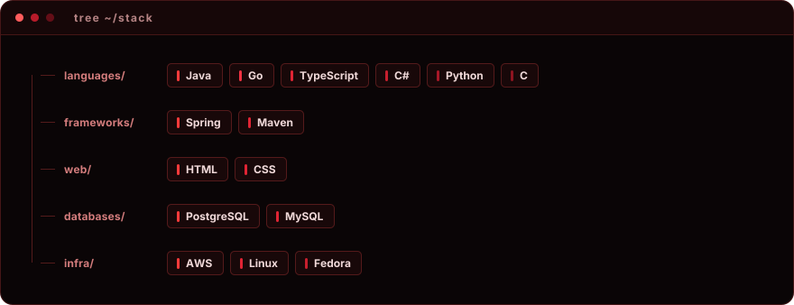
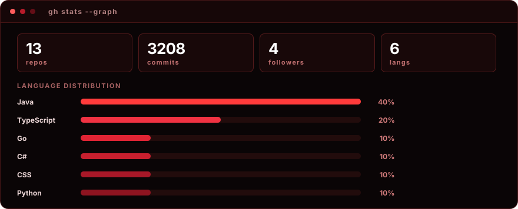
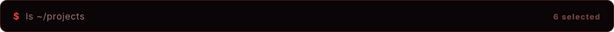
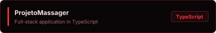
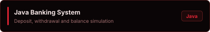
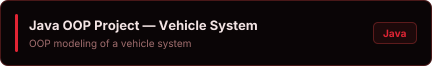
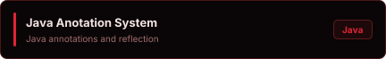
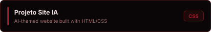

<!--
  ATENCAO: este README e GERADO. Nao edite README.md.
  Edite este arquivo (readme.source.md) e rode: npx readme-aura build -g Guilherme-lima-18
  Qualquer alteracao feita no README.md e perdida no proximo build.
-->

I build things, break them, and rebuild them better. 
Most of what I know started as a bug I refused to ignore.

